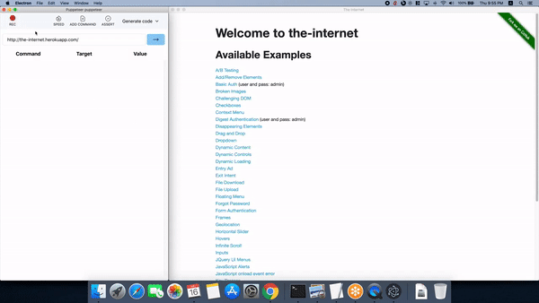

`narrator` helps you record interactions on any website and replay it. It can also generate code for various test platforms for the recorded script. Right now it generates puppeteer code but generators for other test runners can be added very easily.



Here's a small video of `narrator` in action - https://youtu.be/117_VtQeP08

It's built on electron and uses puppeteer to render page and replay the recorded tests. It uses a lot of code from [selenium-ide](https://github.com/seleniumhq/selenium-ide) and I would like to thank all the contributors of selenium-ide. I know they are also planning to switch to electron from the current browser extension model.

I have not yet built a binary for distribution. You will have to download the code and build it on your machine to see it in action.

### Develop

How to see stuff - 

```bash
git clone https://github.com/mukeshsoni/narrator
cd narrator
npm install
npm run dev
```

The electron app uses prebuilt recorder and findandselect modules. `npm run build` builds `recorder` and `findandselect` modules. `npm run dev` first runs `npm run build` before building and starting `electron` app.

To build the recorder in watch mode so that changes to recorder are reflected in
the main process -

```bash
npm run build:recorder -- --watch
```

